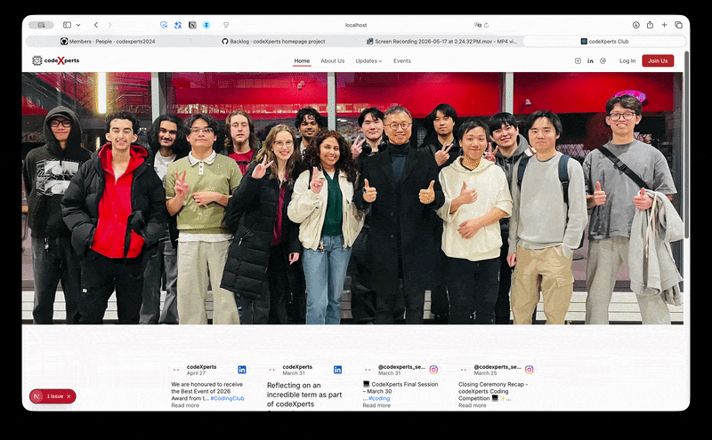

```
 ██████╗ ██████╗ ██████╗ ███████╗██╗  ██╗██████╗ ███████╗██████╗ ████████╗███████╗
██╔════╝██╔═══██╗██╔══██╗██╔════╝╚██╗██╔╝██╔══██╗██╔════╝██╔══██╗╚══██╔══╝██╔════╝
██║     ██║   ██║██║  ██║█████╗   ╚███╔╝ ██████╔╝█████╗  ██████╔╝   ██║   ███████╗
██║     ██║   ██║██║  ██║██╔══╝   ██╔██╗ ██╔═══╝ ██╔══╝  ██╔══██╗   ██║   ╚════██║
╚██████╗╚██████╔╝██████╔╝███████╗██╔╝ ██╗██║     ███████╗██║  ██║   ██║   ███████║
 ╚═════╝ ╚═════╝ ╚═════╝ ╚══════╝╚═╝  ╚═╝╚═╝     ╚══════╝╚═╝  ╚═╝   ╚═╝   ╚══════╝
```

<div align="center">

**A real-world Agile team project — 7 members, 6-week sprint cycle, full-stack web app.**

    


</div>

---
### [codeXperts Preview](codexperts-web-psi.vercel.app)

### [codeXperts Production](codexperts.ca)
<div align="center">



</div>

---

## What We Built

The **codeXperts Club** official website — a members-only platform for a coding club at the University of Waterloo. Built end-to-end by a 7-person team following Agile practices over a 6-week sprint.

| Feature | Description |
|---------|-------------|
| **Google OAuth + RBAC** | 4-tier role system (Public → Member → Executive → Admin) with Supabase RLS enforcement |
| **Coding Problems** | Weekly problems posted by execs, solved in a Monaco Editor (VSCode-style), executed via Piston API |
| **QR Attendance** | Admin generates a session token → members scan to check in → auto-expires |
| **Schedule Page** | Google Calendar API integration — synced events with subscribe/download for members |
| **Member Directory** | Filterable profile cards with cohort, school, role badges, and per-field visibility controls |
| **Activity Heatmap** | GitHub-style contribution graph per member, combining submissions and attendance |
| **Events Page** | Past and upcoming events with dark mode support |
| **Announcements** | Role-gated announcement board |

---

## Stack & Key Decisions

| Layer | Choice | Why |
|-------|--------|-----|
| **Frontend** | Next.js 16 (App Router) | SSR for schedule/calendar pages; app router for per-route auth guards |
| **Styling** | Tailwind CSS | Rapid iteration across 7 contributors without CSS conflicts |
| **Auth + DB** | Supabase | Google OAuth out of the box; RLS policies enforce RBAC at the DB level — no leaking data through API mistakes |
| **Backend** | FastAPI (Railway) | Lightweight proxy for Piston code execution and QR token validation; decoupled from Vercel edge |
| **Deployment** | Vercel + Railway | Zero-config preview deploys per PR on Vercel; Railway for persistent Python backend |

---

## Team

| Name | Role |
|------|------|
| **Paul** | PM / Full-Stack / UI/UX |
| **Kai** | Frontend |
| **Dave** | Backend (FastAPI / Railway / Deployment) / Frontend |
| **Gary** | Backend (Supabase / DB & Auth) |
| **Judy** | Frontend |
| **Andra** | Frontend / Backend |
| **Sid** | Backend (Monaco Editor / Piston API) / UI/UX |

---

## System Architecture

```
Frontend (Next.js — Vercel)
│
├── Supabase
│   ├── Auth (Google OAuth only)
│   └── PostgreSQL
│       ├── profiles       → id, name, email, role, school, cohort, status, bio,
│       │                     linkedin, github, avatar_url, profile_visibility (JSONB)
│       ├── problems       → id, title, description, file_url, created_at
│       ├── submissions    → profile_id, problem_id, code, language, ai_feedback
│       ├── sessions       → token, expires_time, is_active
│       ├── attendances    → profile_id, session_id, checked_at
│       └── announcements  → author_id, title, content, created_at
│
└── FastAPI (Railway)
    ├── /health            → service health check
    ├── /execute           → proxy to Piston API (code execution)
    └── /attendance/verify → QR token validation
```

**Role-Based Access Control:**

```
Public (Unauthenticated)
  └── Member (Approved)
        └── Executive
              └── Admin
```

| Role | Access |
|------|--------|
| **Public** | Landing, public announcements |
| **Member** | Dashboard, member directory, problem submissions |
| **Executive** | Post problems, manage sessions |
| **Admin** | User approval, role management, full access |

**Onboarding flow:** `Google Sign-In → pending → Admin approval → member`

---

## Agile Process

7-person team, weekly sprints, Saturday standups at 7:30 PM via Google Meet.
Each PR is reviewed before merging to `develop`; `develop` merges to `main` at sprint close.

```
Planning → Design → Development → Testing → Review & Release
   ↑                                               │
   └───────────────── next sprint ◀────────────────┘
```

<!-- SPRINT_REPORT_TOTAL_START -->
```
Sprint Contribution Report — Total
───────────────────────────────────
Name    Issues Contribution
───────────────────────────────────
Paul    20     ████████████████████████████████████████

Dave    8      ████████████████

Gary    6      ████████████

Kai     5      ██████████

Sid     3      ██████

Andra   2      ████

Judy    2      ████

───────────────────────────────────
```
<!-- SPRINT_REPORT_TOTAL_END -->

<details>
<summary><strong>Week 1</strong> — Foundation & Setup</summary>

**Planning**
- Defined 6-week roadmap and MVP scope · Created GitHub Issues · Assigned tasks across FE/BE · Set up GitHub Projects Kanban board

**Design**
- Finalized sitemap and page visibility rules · Produced Figma wireframes for all 8 pages · Finalized DB schema (profiles, problems, submissions, sessions, attendances, announcements) · Defined navbar structure and social link config

**Development**
- Next.js + Tailwind project setup · Supabase project created + Google OAuth configured · RLS policies drafted · Vercel + Railway pipelines connected · Placeholder pages scaffolded for all routes

**Testing**
- Google login → pending user flow tested end-to-end · Vercel preview deploy verified · Environment variable setup confirmed across team

**Review & Release**
- Sprint retrospective completed · Foundation merged to `develop` · Preview URL shared with team


<!-- SPRINT_REPORT_W1_START -->
```
Sprint Contribution Report — Week 1
──────────────────────────────────────
Name    Done/All  Contribution
──────────────────────────────────────
Paul    6/6       ████████████

Gary    3/3       ██████

Dave    3/3       ██████

Sid     1/1       ██

Kai     1/1       ██

Andra   1/1       ██

Judy    0         

──────────────────────────────────────
```
<!-- SPRINT_REPORT_W1_END -->

</details>

<details>
<summary><strong>Week 2</strong> — Auth Flow & Public Pages</summary>

**Planning**
- Sprint goal defined: complete auth flow and build all public-facing pages · Issues #14 (role-based navbar), #15 (Google OAuth login), #20 (Join Us modal) scoped and assigned · Design system tokens scoped as prerequisite for all UI work

**Design**
- Members page structure defined · Individual profile page spec (`/members/:id`) · Self-edit mode with per-field visibility controls · Student/Graduate status toggle · Stitch wireframes finalized for all member-facing views

**Development**
- Design system initialized: color tokens, Inter/Montserrat fonts, base UI components (#64, #66, #67) · Role-based navbar with social hover dropdowns (#14) · Google OAuth login + pending screen (#15) · Homepage built: hero section, Elfsight Instagram embed, About section · `feature/auth-role-guard`: ProtectedRoute middleware, PENDING/EXECUTIVE roles, RoleGuard refactored (#65) · RLS policies finalized for all Supabase tables (#70) · `feature/join-modal-issue-20`: Google OAuth signup modal with campus/cohort/phone fields and profile completion (#72)

**Testing**
- Google OAuth → pending screen → admin approval → member role flow tested end-to-end · Protected Route enforcement validated · RLS policy enforcement verified on Supabase · All public pages reviewed on Vercel preview

**Review & Release**
- 7 PRs reviewed and merged to develop (#64, #65, #66, #67, #70, #71, #72) · Sprint 2 retrospective completed · Auth flow and all public pages live on Vercel preview


<!-- SPRINT_REPORT_W2_START -->
```
Sprint Contribution Report — Week 2
──────────────────────────────────────
Name    Done/All  Contribution
──────────────────────────────────────
Paul    4/4       ████████

Dave    3/3       ██████

Kai     2/4       ████░░░░

Andra   1/2       ██░░

Sid     1/1       ██

Gary    1/1       ██

Judy    0         

──────────────────────────────────────
```
<!-- SPRINT_REPORT_W2_END -->

</details>

<details>
<summary><strong>Week 3</strong> — Schedule Page & Timezone Bugs</summary>

**Planning**
- Issue #18 (Schedule page) scoped and carried forward · Judy onboarded as Frontend

**Design**
- 3-Layer Depth System designed (L0 `#F9F9F9` → L1 `#EAEAEA` → L2 `#DBDBDB`) and documented in design-system.md · Schedule page spec fully rewritten to match implementation · Tailwind custom depth tokens defined (`bg-bg-layer1/2/2Hover`)

**Development**
- `feature/schedule-page-issue-18`: server-side iCal parser (`/api/calendar`) with RRULE expansion and EXDATE support · Schedule page rebuilt with Google Calendar embed, custom month nav, event list with start/end time, and event detail modal (Google Maps link) · UTC→Toronto timezone conversion · Join flow converted from dedicated route to Navbar modal (`/join` → redirect)

**Testing**
- EXDATE `VALUE=DATE` timezone day-shift bug found and fixed · UTC time offset bug (01:30 UTC displaying as 1:30 AM instead of 9:30 PM EDT) caught and fixed · Copilot AI review: 5 issues addressed (race condition, RRULE UNTIL boundary, dead code, React key, modal scroll lock) · Vercel preview QA passed

**Review & Release**
- PR #78 opened with Copilot automated review · All review comments triaged and addressed · Issue #18 implementation summary posted · `develop` merge pending final approval


<!-- SPRINT_REPORT_W3_START -->
```
Sprint Contribution Report — Week 3
──────────────────────────────────────
Name    Done/All  Contribution
──────────────────────────────────────
Paul    2/2       ████

Dave    2/2       ████

Judy    2/2       ████

Sid     1/1       ██

Kai     1/1       ██

Gary    0/1       ░░

Andra   0         

──────────────────────────────────────
```
<!-- SPRINT_REPORT_W3_END -->

</details>

<details>
<summary><strong>Week 4</strong> — Problem List, Events & Members</summary>

**Planning**
- Problem List page permissions scoped (PR #74, #77 executive role fix) · Members page filter and profile detail defined as next milestone · Instagram feed Vercel deployment issue flagged · Railway trial expiry noted; fallback confirmed as non-blocking

**Design**
- Events card height uniformity and newest-left sort order confirmed per team feedback · Members cohort display finalized as numeric badge (1, 2, 3...) per Figma spec · Mobile layout adjustments scoped for Home and About Us pages

**Development**
- Navbar modal fixed and Google Auth login wired (Dave) · Problem List page implemented with React Markdown library — PR #74, #77 executive permission fix · Schedule page: Google Calendar API integrated with member subscribe/download (Paul) · Events page: dark mode and component split underway; 404 and image path bugs identified (Andra) · Members page: design and markup complete, mock data populated, filter and profile detail pages next (Judy) · Mobile layout position adjustments for Home and About Us (Kai) · Announcement page in progress (Kai)

**Testing**
- Instagram feed confirmed working locally but failing on Vercel; CORS/env investigation pending · Events page 404 and image path errors surfaced after component refactor · Problem List executive permission fix validated (PR #74, #77)

**Review & Release**
- All team PRs merged to main by Paul · Railway infrastructure fallback plan confirmed (no production impact) · Andra's Events bug fix and Dave's Auth login wiring targeted for completion before next standup

<!-- demo_w4.gif: add when Week 4 recording is ready -->

<!-- SPRINT_REPORT_W4_START -->
```
Sprint Contribution Report — Week 4
──────────────────────────────────────
Name    Done/All  Contribution
──────────────────────────────────────
Paul    4/5       ████████░░

Gary    1/1       ██

Sid     0         

Kai     0         

Andra   0         

Dave    0         

Judy    0         

──────────────────────────────────────
```
<!-- SPRINT_REPORT_W4_END -->

</details>

---

## GitHub Projects — Kanban Board

| Column | Description |
|--------|-------------|
| `Backlog` | Unscheduled items |
| `Ready` | Committed for current sprint |
| `In Progress` | Actively being developed |
| `In Review` | PR open, awaiting review |
| `Done` | Merged and deployed |

**Issue & PR Convention**
- Issue title format: `[Type] Short description` — types: `feat`, `fix`, `docs`, `refactor`, `chore`
- All PRs require at least 1 reviewer approval before merge
- PRs are linked to their corresponding issue

**Branch Strategy**

| Branch | Purpose |
|--------|---------|
| `main` | Production-ready code only |
| `develop` | Integration branch — all features merge here first |
| `feature/*` | Individual feature or fix branches |

> Never commit directly to `main`. All changes go through `develop` via reviewed PRs.

---

## Deployment

| Layer | Platform | Domain |
|-------|----------|--------|
| Frontend | Vercel | codexperts.ca |
| Backend | Railway | auto-assigned Railway URL |
| Database & Auth | Supabase | managed |

> Starting with Vercel free subdomain. Will migrate to `codexperts.ca` upon MVP completion.

---

## Folder Structure

```
codexperts-web/
├── public/
├── src/
│   ├── app/                 # Next.js App Router
│   │   ├── layout.js        # Root layout (Navbar included)
│   │   ├── page.js          # / Home
│   │   ├── about/           # /about
│   │   ├── schedule/        # /schedule
│   │   ├── api/             # Next.js API routes
│   │   │   └── calendar/    # GET /api/calendar — iCal fetch + parse (no API key)
│   │   ├── announcements/   # /announcements
│   │   ├── events/          # /events
│   │   ├── join/            # /join — redirects to / (join flow is Navbar modal)
│   │   ├── problems/        # /problems (member only)
│   │   ├── solutions/       # /solutions (member only)
│   │   ├── members/         # /members (member only)
│   │   └── admin/           # /admin (admin only)
│   ├── components/
│   │   ├── common/          # Navbar, Footer
│   │   ├── auth/            # ProtectedRoute, RoleGuard
│   │   └── ui/              # Button, Card, Modal
│   ├── config/
│   │   └── socialLinks.js   # Campus social media links config
│   ├── lib/
│   │   └── supabase.js      # Supabase client singleton
│   ├── hooks/               # useAuth, useRole
│   ├── contexts/            # AuthContext
│   ├── services/            # Supabase service modules
│   └── utils/               # Helper functions, constants
├── docs/
│   ├── design/              # Design system, sitemap, page-level specs
│   ├── guidelines/          # code-conventions.md, git-workflow.md
│   ├── meeting-notes/       # Sprint meeting records
│   ├── sprints/             # Sprint plan + weekly specs
│   └── schema/              # Database schema definitions
├── backend/
│   ├── main.py              # FastAPI entry point
│   ├── requirements.txt
│   ├── .env.example
│   └── routers/
├── scripts/
│   └── sprint-report.js     # CLI tool — GitHub Issue contribution report per member
├── package.json
└── README.md
```

---

## Getting Started

**Prerequisites:** Node.js v18+, a Supabase project with Google OAuth and PostgreSQL enabled.

```bash
git clone https://github.com/codexperts2024/codexperts-web.git
cd codexperts-web
npm install
cp .env.example .env.local
# Fill in your Supabase config values
npm run dev
```

App runs at `http://localhost:3000`.

**Environment variables:**

| Variable | Required | Description |
|----------|----------|-------------|
| `NEXT_PUBLIC_SUPABASE_URL` | Yes | Supabase project URL |
| `NEXT_PUBLIC_SUPABASE_ANON_KEY` | Yes | Supabase anon key |
| `SUPABASE_SERVICE_ROLE_KEY` | Backend only | Never expose to client |
| `NEXT_PUBLIC_API_URL` | Yes | Railway FastAPI URL |
| `CONTACT_EMAIL_USER` | Yes | Gmail address for contact form SMTP |
| `CONTACT_EMAIL_PASS` | Yes | Gmail App Password (not your account password) — generate at [myaccount.google.com/apppasswords](https://myaccount.google.com/apppasswords) |

> **To add York University's club signup link:** open [`src/config/socialLinks.js`](src/config/socialLinks.js) and set the `url` field in the `clubSignup` array for `York University`.

**Sprint contribution report:**
```bash
npm run report          # all-time closed issues per member
npm run report -- 4     # Week 4 breakdown (closed vs. open)
```

---

*Built with intention. Deployed with confidence.*
